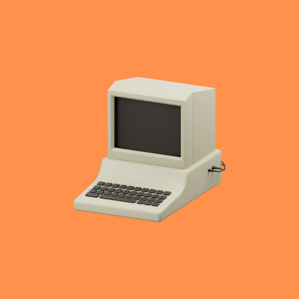
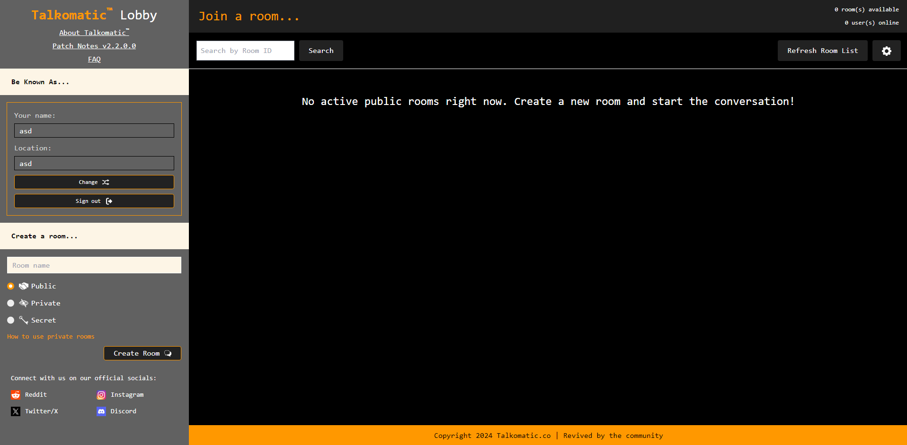
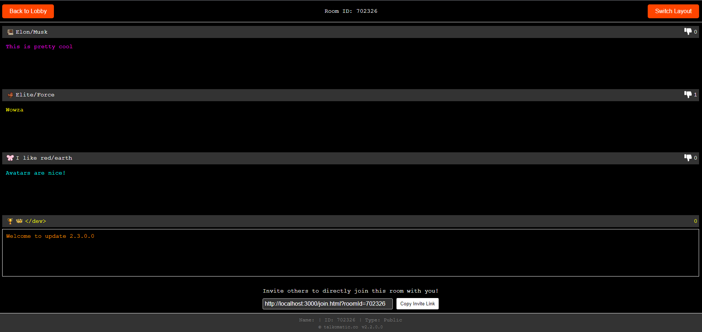
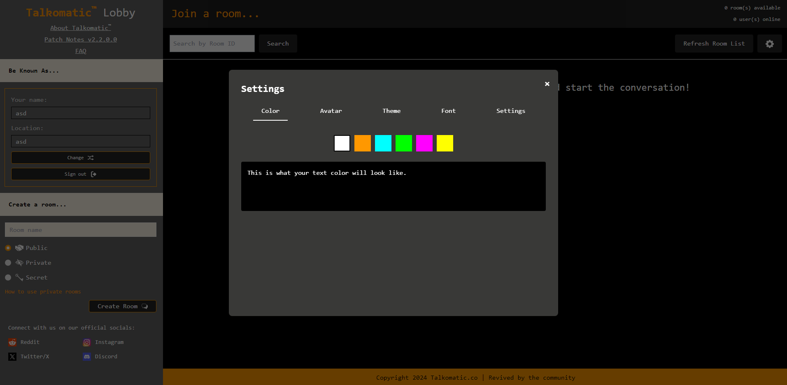
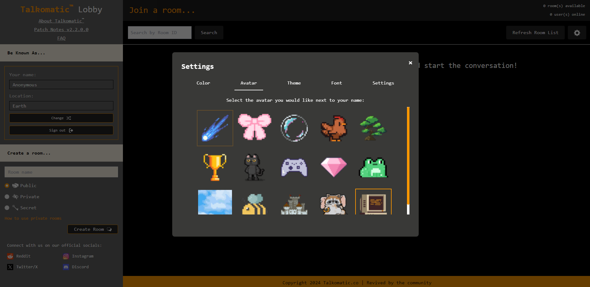

# Talkomatic



Talkomatic is a modern revival of the pioneering chat system originally created in 1973. This web-based version brings the innovative real-time messaging experience to today's users while honoring its historical significance.

[](https://github.com/MohdYahyaMahmodi/talkomatic)
[](https://www.talkomatic.co)
[](LICENSE)

## Table of Contents

- [Overview](#overview)
- [Features](#features)
- [Screenshots](#screenshots)
- [Installation](#installation)
- [Usage](#usage)
- [Contributing](#contributing)
- [Social Channels](#social-channels)
- [License](#license)
- [Contact](#contact)

## Overview

Talkomatic, a pioneering computer-based chat system, was originally developed in 1973 by Doug Brown and David R. Woolley at the University of Illinois as part of the PLATO system. In 2024, software developer [Mohd Mahmodi](https://twitter.com/mohdmahmodi) rebuilt the web version of Talkomatic, introducing modern features and improvements while preserving its innovative spirit.

This revival project was initiated with several key objectives:

1. **Historical Preservation**: To honor and maintain the legacy of one of the earliest real-time chat systems, ensuring its place in the history of online communication is not forgotten.

2. **Educational Value**: To provide a hands-on experience for those interested in the evolution of digital communication, allowing users to interact with a modernized version of a groundbreaking chat system.

3. **Technological Advancement**: To demonstrate how classic concepts can be adapted and enhanced using modern web technologies, creating a bridge between past innovations and current capabilities.

4. **Community Engagement**: To foster a community of users and developers interested in the history and future of online communication platforms.

The decision to make Talkomatic open source was driven by several factors:

1. **Collaborative Improvement**: By opening the codebase to the community, we invite diverse perspectives and skills to contribute to the project's ongoing development and refinement.

2. **Transparency**: Open source allows users to understand how the system works, building trust and encouraging a deeper appreciation of the technology.

3. **Educational Resource**: The open codebase serves as a learning tool for developers interested in real-time web applications and chat systems.

4. **Longevity**: Open source ensures that Talkomatic can continue to evolve and be maintained by the community, even beyond any single developer's involvement.

This modern iteration of Talkomatic brings the groundbreaking real-time messaging experience to contemporary users, bridging the gap between historical significance and modern communication needs. We invite you to explore, use, and contribute to this piece of computing history.

## Features

- **Modern Web Interface:** Clean, contemporary design that retains the essence of the original Talkomatic
- **Real-Time Communication:** Character-by-character live messaging system
- **Multiple Chat Rooms:** Join various rooms, each supporting multiple participants
- **Flexible Chat Windows:** Toggle between vertical and horizontal layouts
- **Moderation:** Automated system to filter foul language and human moderators for maintaining a safe environment
- **Accessibility:** Browser-based access with no installation required
- **Open Source:** Community contributions encouraged

## Screenshots

### Home Screen


### Chat Interface


### Settings Modal - Color Selection


### Settings Modal - Avatar Selection


## Installation

1. Clone the repository:
   ```
   git clone https://github.com/MohdYahyaMahmodi/talkomatic.git
   ```
2. Navigate to the project directory:
   ```
   cd talkomatic
   ```
3. Install dependencies:
   ```
   npm install
   ```
4. Start the development server:
   ```
   node server.js
   ```

## Usage

Access Talkomatic by navigating to `http://localhost:3000` in your web browser after starting the development server.

## Contributing

We welcome contributions! To contribute:

1. Fork the repository
2. Create a new branch (`git checkout -b feature/YourFeature`)
3. Make your changes and commit them (`git commit -m 'Add YourFeature'`)
4. Push to the branch (`git push origin feature/YourFeature`)
5. Open a pull request

Please read our [Contributing Guidelines](CONTRIBUTING.md) for more details.

## Social Channels

Stay connected with the Talkomatic community:

[](https://www.instagram.com/talkomaticofficial/)
[](https://www.reddit.com/r/talkomatic/)
[](https://twitter.com/talkomatic_co)
[](https://discord.com/invite/AY7Bk6zgze)

## License

Talkomatic is licensed under the MIT License. See the [LICENSE](LICENSE) file for more information.

## Contact

We value your input! For questions, feedback, or just to chat, connect with us on our social platforms:

[](https://www.instagram.com/talkomaticofficial/)
[](https://www.reddit.com/r/talkomatic/)
[](https://twitter.com/talkomatic_co)
[](https://discord.com/invite/AY7Bk6zgze)

Your thoughts help shape Talkomatic's future. We look forward to hearing from you!

---

Thank you for using Talkomatic! We hope you enjoy this modern revival of a pioneering chat system.
